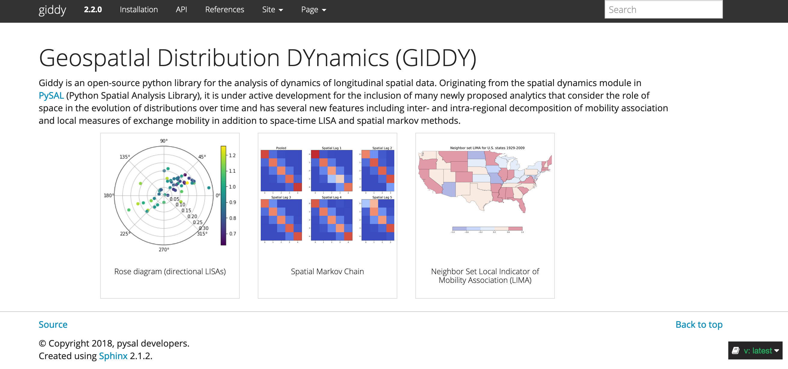

For Users
---------

Users can begin the journey with PySAL by exploring the courses,
workshops, tutorials, and presentations:

### Courses, Workshops, and Tutorials

-   [NARSC 2018](https://github.com/sjsrey/pysalnarsc18)
-   [SciPy 2018](https://www.youtube.com/watch?v=kJXUUO5M4ok)
-   [GeoPython 2018](https://github.com/ljwolf/geopython)
-   [NARSC 2017](https://github.com/sjsrey/pysalnarsc17)
-   [SciPy 2016](https://www.youtube.com/watch?v=TY4QWnnd4jY)
-   [UCGIS 2016](https://github.com/sjsrey/ucgis_workshop_2016)
-   [NARSC 2015](https://github.com/sjsrey/pysal_narsc_2015)
-   [AUERS 2015](https://github.com/pysal/notebooks/tree/aerus2015)
-   [Tour of PySAL 2015](https://www.youtube.com/watch?v=vXnEH5pFxtY)
-   [FOSS4G
    2015](https://2015.foss4g-na.org/session/hands-introduction-spatial-data-analysis-python)
-   [MASGIS 2015](https://github.com/pysal/notebooks/tree/masgis_2015)
-   [FOSS4G 2014](https://github.com/sjsrey/foss4g14)
-   [GIScience
    2014](https://github.com/pysal/notebooks/tree/giscience14)
-   [NARSC 2013](https://github.com/sjsrey/narsc2013_pysal_workshop)

### Presentations

-   [SciPy 2018 Neighborhood
    dynamics](https://www.youtube.com/watch?v=VWMj_rNb0io)
-   [SciPy 2015 Tests for spatial effects in the discrete Markov chains
    model](https://www.youtube.com/watch?v=rfQ0LIaOgQs)
-   [CyberGIS 2013](https://www.youtube.com/watch?v=piB7zTADzcE)
-   [ESRI UC
    2012](http://video.esri.com/watch/1925/integrating-open_dash_source-statistical-packages-with-arcgis)
-   [SciPy 2012](https://www.youtube.com/watch?v=FN1nH4Fkd_Y)
-   [PyCon 2012
    US](http://pyvideo.org/video/676/python-for-data-lovers-explore-it-analyze-it-m)
-   [SciPy 2009](https://archive.org/details/scipy09_day2_10-Serge_Rey)

For developers
--------------

Developers for PySAL and its submodules are expected to follow [Github
Standard Operating
Procedures](https://github.com/pysal/pysal/wiki/GitHub-Standard-Operating-Procedures).

In order for packages to be included into PySAL as a submodule, it must
follow the Submodule Contract below:

### Submodule Contract

#### Python version

-   must support python 3.

#### Structure

-   must be organized in a hierarchical fashion. More specifically:
    -   **tests** should be inside of the package folder, rather than
        outside.
    -   **data** within tests is only referred to by tests, and is used
        as comparison output for testing.
    -   **notebooks** is outside of the package folder.

#### Documentation & testing

-   must have unittesting on user-facing classes (those exposed by the
    API)
-   must have docstrings for all user-facing functions
-   must run these tests nightly (using either
    [nightli.es](https://nightli.es) or CRON jobs on travis)
-   must have three notebooks in `notebooks`
-   must host documentation (see the next section for guidelines of
    building a doc website)

#### Code Standards

-   must refer to data in `libpysal.examples`
-   must only have module-level imports that the package supports in its
    `requirements.txt`
-   must write `from submodule import function` instead of
    `import submodule.function` if it wants to use a function of a PySAL
    submodule
-   all function-level imports (those made at the top of a function)
    must be decorated with the [requires
    decorator](https://github.com/pysal/libpysal/blob/master/libpysal/common.py#L104)
    or raises an explicit exception (i.e. `raise ImportError('this
    function requires "PACKAGE", which is not
    installed.`)) if its requirements are not met.
-   must be pep8 compliant. We recommend using
    [autopep8](https://github.com/hhatto/autopep8) to automatically
    convert non-compliant code, and using
    [flake8](http://flake8.pycqa.org/en/latest/) thereafter.

### Submodule Template

The repo
[pysal/submodule\_template](https://github.com/pysal/submodule_template)
provides a useful template for submodules covering:

-    how to configure travis-CI dual tests: [.travis.yml](https://github.com/pysal/submodule_template/blob/master/.travis.yml)
    -   assuming that `libpysal` is a dependency of the submodule, an example of dual travis-CI testing against `libpysal` is provided.
    -   basically, the dual testing configures travis-CI to test
            against two versions of `libpysal`: pypi released stable
            version and the github development version.

-   how to describes the metadata about the submodule:
    [setup.py](https://github.com/pysal/submodule_template/blob/master/setup.py)
-   how to customize Sphinx input and output behavior for mimicking
    `giddy`\'s [online documentation](http://giddy.readthedocs.io/):
    [doc/conf.py](https://github.com/pysal/submodule_template/blob/master/doc/conf.py)
-   how to structure the package:

        PACKAGE_NAME/
            LICENSE.txt
            README.txt
            setup.py
            .travis.yml
            PACKAGE_NAME/
                __init__.py
            notebooks/
            requirements.txt
            requirements_tests.txt
            requirements_docs.txt
            readthedocs.yml
            doc/
                Makefile
                conf.py
                index.rst
                installation.rst
                api.rst
                references.rst
                _static/
                    references.bib
                    pysal-styles.css
                    images/
                        pysal_favicon.ico
                _build/

All the files in the [doc/](https://github.com/pysal/submodule_template/tree/master/doc) directory together with
[requirements\_docs.txt](https://github.com/pysal/submodule_template/blob/master/requirements_docs.txt) and 
[readthedocs.yml](https://github.com/pysal/submodule_template/blob/master/readthedocs.yml)
are essential for building the online docs for the submodule. More
details are given below.

### Building an online documentation for the submodule mimicking [giddy\_docs](http://giddy.readthedocs.io) {#PySAL-submodule-docs}

We recommend building a documentation website for your package with:

-   [sphinx](http://www.sphinx-doc.org/en/master/), the **Python
    Documentation Generator**, which semi-automatically creates
    beautiful documentation.
-   [sphinx\_bootstrap\_theme](https://sphinx-bootstrap-theme.readthedocs.io/en/latest/README.html),
    a python package providing Sphinx themes which integrates the
    Bootstrap CSS/JavaScript framework with various layout options.
-   [readthedocs](https://readthedocs.org/), which pull the code from
    the github repository, build documentation and host it for free. It
    is capable of hosting multiple versions of documentation.

The workflow is briefly introduced as follows:

#### Set up a `sphinx` project

-   Install `sphinx`, `sphinx_bootstrap_theme` as well as several
    `sphinx` extensions which are very useful in generating an elegant
    and user-friendly online documentation from `pip`:

        pip install sphinx sphinx_bootstrap_theme sphinxcontrib-bibtex numpydoc

-   Instead of initializing a new `sphinx` project using the tool,
    **sphinx-quickstart**, developers wishing to mimic the
    [giddy\_docs](http://giddy.readthedocs.io) can use the templates
    provided by the
    [pysal/submodule\_template](https://github.com/pysal/submodule_template)
    by copying its directory
    [doc/](https://github.com/pysal/submodule_template/tree/master/doc)
    (together with all the files inside) to your submodule.
    -   Open the copy of
        [doc/conf.py](https://github.com/pysal/submodule_template/blob/master/doc/conf.py)
        in your submodule, and change all the
        `PACKAGE\_NAME` to your submodule name so that the
        Sphinx input and output behavior of your submodule are
        configured.
    -   Open the copy of
        [doc/Makefile](https://github.com/pysal/submodule_template/blob/master/doc/Makefile)
        and
        [doc/make.bat](https://github.com/pysal/submodule_template/blob/master/doc/make.bat)
        in your submodule, and change the `PACKAGE\_NAME` to
        your submodule name.
-   Now the online docs should be rendered in the same fashion as
    [giddy\_docs](http://giddy.readthedocs.io). The next steps will be
    to fill in the content.

#### Creating documentation for Python docstrings

The pysal submodule is expected to contain two distinct forms of
documentation: inline and non-inline. Inline docs are contained in the
source code itself, in what are known as *docstrings*. Non-inline docs
are written in reStructuredText and their sources (such as
[doc/installation.rst](https://github.com/pysal/submodule_template/blob/master/doc/installation.rst))
are in the `doc/` directory.

##### Non-inline Documentation

The non-inline docs should be written in
[reStructuredText(.rst)](http://docutils.sourceforge.net/rst.html) and
their sources live in the `doc/` directory.
`sphinx` will create HTML (and LaTeX (for printable PDF
versions), ePub, etc) files from the .rst sources. Currently, four .rst
files are living in
[doc/](https://github.com/pysal/submodule_template/tree/master/doc) of
[pysal/submodule\_template](https://github.com/pysal/submodule_template),
each of which will be read and built into four HTML files by \`sphinx\`:

-   [doc/index.rst](https://github.com/pysal/submodule_template/blob/master/doc/index.rst):
    landing page for the online documentation. Should contain a brief
    introduction of the submodule.
-   [doc/installation.rst](https://github.com/pysal/submodule_template/blob/master/doc/installation.rst):
    installation page.
-   [doc/api.rst](https://github.com/pysal/submodule_template/blob/master/doc/api.rst):
    API reference page providing links to inline documentation with the
    help of sphinx extensions
    [numpydoc](http://numpydoc.readthedocs.io),
    [sphinx.ext.autodoc](http://www.sphinx-doc.org/en/stable/ext/autodoc.html)
    and
    [sphinx.ext.autosummary](http://www.sphinx-doc.org/en/stable/ext/autosummary.html).
-   [doc/reference.rst](https://github.com/pysal/submodule_template/blob/master/doc/references.rst):
    bibliography page capable of cross-referencing with the help of the
    sphinx extension
    [sphinxcontrib-bibtex](http://sphinxcontrib-bibtex.readthedocs.io).

To add all of them to the navigation bar menu of the online docs, the
[navbar\_links
property](https://github.com/pysal/submodule_template/blob/master/doc/conf.py#L169)
in
[doc/conf.py](https://github.com/pysal/submodule_template/blob/master/doc/conf.py)
needs to be properly configured. Follow the same procedure to add other
webpages to the online documentation of your submodule.

##### Inline Documentation

The following Sphinx extensions are used for parsing inline *docstrings*
and semi-automatically pulling in documentation from docstrings:

-   [numpydoc](http://numpydoc.readthedocs.io)
-   [sphinx.ext.autodoc](http://www.sphinx-doc.org/en/stable/ext/autodoc.html)
-   [sphinx.ext.autosummary](http://www.sphinx-doc.org/en/stable/ext/autosummary.html)

Since the extension [numpydoc](http://numpydoc.readthedocs.io) is used,
it is recommended that the python *docstrings* in the submodule follow
the [Numpy Docstring
Standard](https://numpydoc.readthedocs.io/en/latest/format.html#docstring-standard).

To utilize the sphinx extension
[sphinx.ext.autodoc](http://www.sphinx-doc.org/en/stable/ext/autodoc.html)
which could import the module, and pull in documentation from docstrings
in a semi-automatic way, you need to list all the classes/functions you
wish to expose to users. As shown in
[pysal/submodule\_template](https://github.com/pysal/submodule_template),
we recommend organizing classes/functions and listing them in
[doc/api.rst](https://github.com/pysal/submodule_template/blob/master/doc/api.rst).
More specifically, open the copy of
[doc/api.rst](https://github.com/pysal/submodule_template/blob/master/doc/api.rst)
in your submodule, and change `PACKAGE\_NAME` right after
the directive `currentmodule` to your submodule. Then, replace the
classes `giddy.markov.Markov` and `giddy.markov.Spatial_Markov` with the
classes and functions of the submodule.

###### Interactive Python examples

It should be noted that the interactive Python examples in the docstring
are not required, but if given, they are required to follow the
[doctest](https://docs.python.org/3.6/library/doctest.html) format and
pass all doctests. They can be checked together with unit testing using
\`nose\`: `nosetests --with-doctest submodule/`

If `matplotlib` is imported in the interactive example, the
[plot directive](https://matplotlib.org/devel/plot_directive.html)
should be used for including the matplotlib plot (a .png file) in the
html docs. An example is given in the
[Rose](https://giddy.readthedocs.io/en/latest/generated/giddy.directional.Rose.html#giddy.directional.Rose)
API of the giddy docs.

#### Bibliography and cross-reference

We leverage the functionality provided by the Sphinx extension for
BibTeX style citations -
[sphinxcontrib-bibtex](http://sphinxcontrib-bibtex.readthedocs.io) to
quickly and conveniently build a bibliography list in the online docs.
The bibliography list is customized to only show those cited in the
online docs in
[doc/reference.rst](https://github.com/pysal/submodule_template/blob/master/doc/references.rst).
To properly create cross-reference and generate the bibliography list,
the followings are needed:

-   update
    [doc/\_static/references.bib](https://github.com/pysal/submodule_template/blob/master/doc/_static/references.bib)
    with the relevant references of your submodule .
-   change the format of citations in *docstrings* and no-inline
    documentation to follow `` :cite:`Press2007 `` in which
    `Press2007` is the key of a bibtex entry in
    [doc/\_static/references.bib]().

#### Generate and test html locally

Now that we have configured the behaviour of input and output of
`sphinx` and added the content, we can run the build locally
to test whether there is any issue and to see how the created html docs
looks like. Since we have
[doc/Makefile](https://github.com/pysal/submodule_template/blob/master/doc/Makefile)
and
[doc/make.bat](https://github.com/pysal/submodule_template/blob/master/doc/make.bat),
we can achieve that very easily by running `make html`:

    make html

A `\_build` folder will be created where all the created
html files live. You can double click to open the html files in a
default browser to check the content and layout.

#### Building, versioning, and hosting the docs with [readthedocs](https://readthedocs.org/)

We recommend hosting the online docs with
[readthedocs](https://readthedocs.org/) since it is free and able to
host and build multiple versions.

After signing in with github to [readthedocs](https://readthedocs.org/),
you can click *Import a Project* to import the submodule and start to
build the online docs. Up to now, it is possible that the docs building
will fail because of some configuration issues:

-   Programming Language: change the **Programming Language** value to
    `python`.
-   Python interpreter: since the submodule supports 3.X only, you need
    to change the **Python interpreter** value from the default `CPython
    2.x` to `CPython 3.x` in Admin-Advanced
    Settings.
-   Docs building dependencies: since we are relying on the python
    package
    [sphinx\_bootstrap\_theme](https://sphinx-bootstrap-theme.readthedocs.io/en/latest/README.html)
    to build an elegant [bootstrap-Yeti](https://bootswatch.com/yeti/)
    website, we need to configure `readthedocs` to install
    the package when building the docs. A successful example of
    configuration is given with the help of a
    [readthedocs.yml](https://github.com/pysal/submodule_template/blob/master/readthedocs.yml)
    and proper configuration of [tests and docs dependencies for
    setup.py](https://github.com/pysal/submodule_template/blob/master/setup.py#L22)
    .
